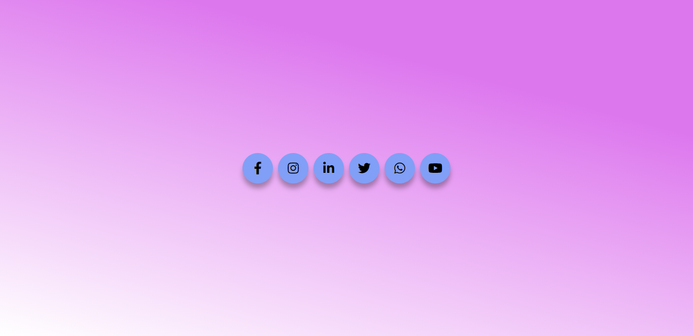

       
       # Amazing Animated Login Form

This is a Awesome Social icons That will be used in Websites As A Contacts Section.

## Table of contents

- [Overview](#overview)
  - [Screenshot](#screenshot)
  - [How to use?](#how-to-use)
    - [Edit The Template](#edit-the-template)
  - [More Information](#more-information)
  - [Built with](#built-with)
- [Author](#author)

**Note: Delete this note and update the table of contents based on what sections you keep.**

## Overview

Users should be able to:

- View the optimal layout depending on their device's screen size

### Screenshot

### How to use ?

Go to [index.html](index.html) and open it with the browser to see the template live

#### Edit the template

Go to [index.html](index.html) and open it then edit

If you have any problem tell us by creating an [issue](https://github.com/mudit023/templates/issues/new/choose)

### More Information

This template is for A Awesome Social Media Icons.

## My process

### Built with

- Semantic HTML5 markup
- CSS custom properties
- Mobile-first workflow

## Author

Created By [Programming-School](https://www.github.com/Programing-School)

- Github - [@Programming-School](https://www.github.com/Programing-School)
- Twitter - [@Programing_Pro](https://www.twitter.com/Programing_Pro)
- YouTube - [@Programming-School](https://www.youtube.com/channel/UC1YTVmV31RZV2oie1kKpJkw)
