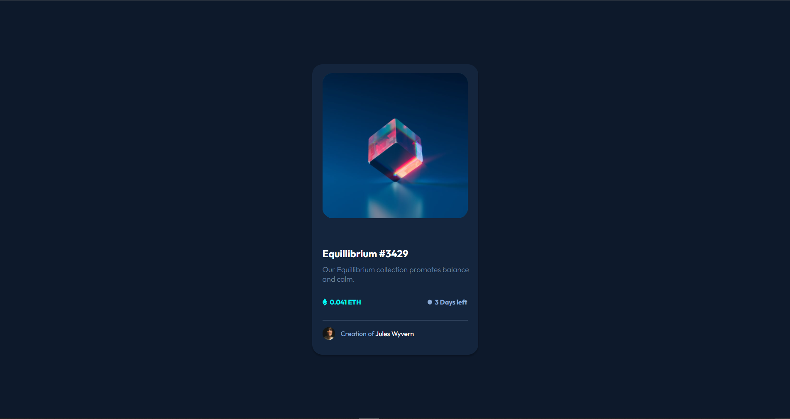

# NFT preview card component

This is a NFT component that will be used in the NFT preview card.

## Table of contents

- [Overview](#overview)
  - [Screenshot](#screenshot)
  - [Built with](#built-with)
- [Author](#author)

## Overview

Users should be able to:

- View the optimal layout depending on their device's screen size
- See hover states for interactive elements

### Screenshot

### Built with

- Semantic HTML5 markup
- CSS custom properties
- Flexbox
- Mobile-first workflow

## Author

- Github - [@imRajAryan09](https://www.github.com/imRajAryan09)
- Twitter - [@codeorfade](https://www.twitter.com/codeorfade)
