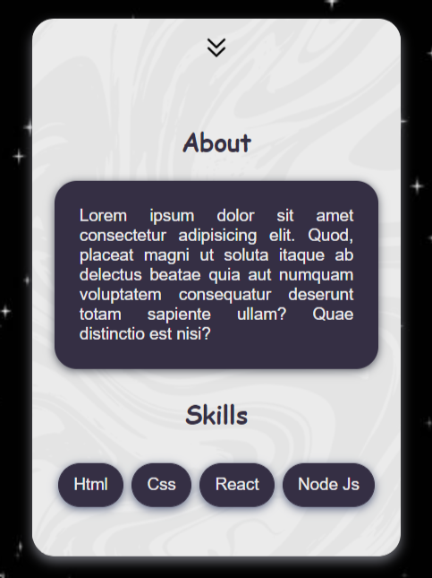

## This is a Profile Card with complete responsiveness and cross-platform access.

**Note: For better comprehension of the code, read the internal comments.**

### Screenshots

         

### Captures

       

### Technology Used

- HTML5
- CSS
- JS

## Created by

- Github - [Param Pragyan](https://github.com/ParamPragyan)
- Link - [Profile-Card](https://willowy-kulfi-53ea96.netlify.app/)
