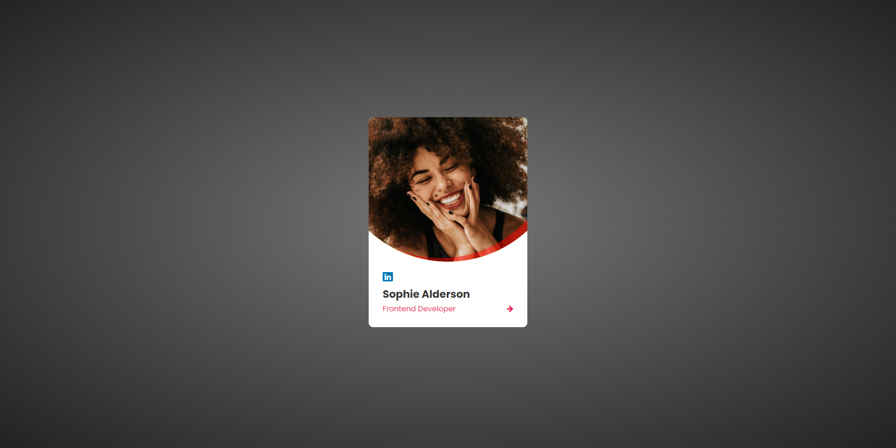

Profile Card Design

## Table of contents

- [Overview](#overview)
  - [Screenshot](#screenshot)
  - [Built with](#built-with)
- [Author](#author)

**Note: Delete this note and update the table of contents based on what sections you keep.**

## Overview

A simple profile card with an image and some text.

### Screenshot

## My process

### Built with

- Semantic HTML5 markup
- CSS custom properties
- Flexbox
- Mobile-first workflow

## Author

- Github - [@imRajAryan09](https://www.github.com/imRajAryan09)
- Twitter - [@codeorfade](https://www.twitter.com/codeorfade)