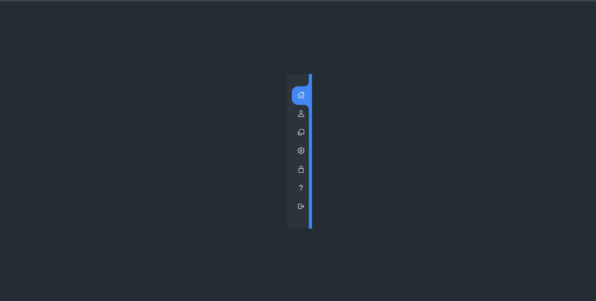
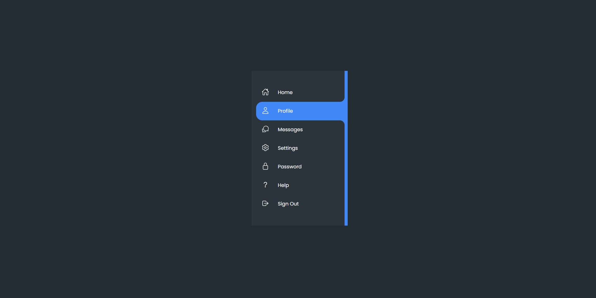

Navbar for Mobile with curved outsides

This is a sample navbar for mobile.

## Table of contents

- [Overview](#overview)
  - [Screenshot](#screenshot)
  - [Built with](#built-with)
- [Author](#author)

**Note: Delete this note and update the table of contents based on what sections you keep.**

## Overview

Users should be able to:

- View the optimal layout depending on their device's screen size

### Screenshot

## My process

### Built with

- Semantic HTML5 markup
- CSS custom properties
- Flexbox
- Mobile-first workflow
- Vanila JS

## Author

- Github - [@imRajAryan09](https://www.github.com/imRajAryan09)
- Twitter - [@codeorfade](https://www.twitter.com/codeorfade)
