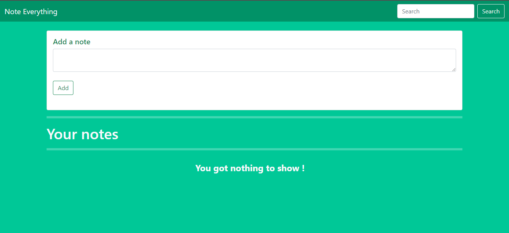

# Note Everything.

This is a open source code to the notes app which uses local storage of your browser which means your data is secured within your device. This web-app also includes of searching functionality.

## Table of contents

- [Overview](#overview)
  - [Links](#links)
  - [Screenshot](#screenshot)
  - [Built with](#built-with)
  - [What I learned](#what-i-learned)
 

## Overview
  
  

### Links

- [Live Site URL](https://usamabinkashif.github.io/note_everything/)
  
  

### Screenshot

  
  

### Built with

- HTML5
- CSS3
- Bootstrap 5
- Pure JavaScript
  
  

### Functionality
- Add notes (title, note).
- Delete Notes.
- Search Notes.
- All your notes will be saved inside your browser local storage so other users can not see it.

  
  

### What I learned

I learned local storage,search functionality, how to make elements with DOM, bootstrap 5.
  
  

# Feel Free To Use It.